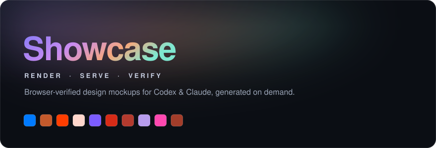
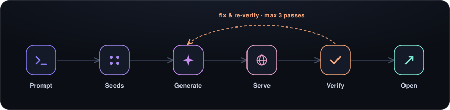
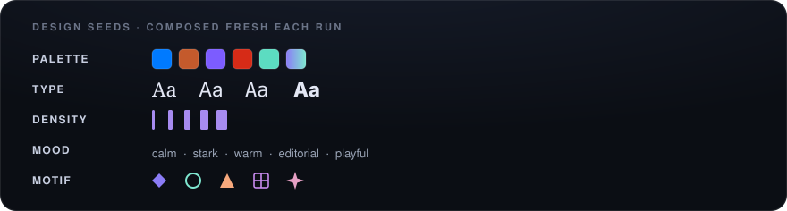

<div align="center">



[](https://github.com/mikec-git/showcase-skill)
[](https://github.com/mikec-git/showcase-skill)
[](#installation)
[](#why-the-verification-loop-exists)
[](https://github.com/mikec-git/showcase-skill/commits/main)

**Browser-verified design mockups for Codex &amp; Claude, generated on demand.**

</div>

A shared Codex and Claude skill for rendering HTML/SVG mockups, slideshows, demos, and before/after comparisons, serving them on localhost for preview, and verifying them in a real browser before the user sees them.

This repository is the single source of truth for both Codex and Claude. Runtime skill paths should symlink back to `skills/showcase` instead of keeping separate copies.

## How It Works

<div align="center">



</div>

- **Parse intent** from a free-text prompt: artifact type (`mockup`, `slides`, `demo`, `before-after`, `landing`), subject, variant count, native-platform hint.
- **Compose seeds** fresh for each variant from five axes (palette, typography, density, mood, motif), so output stays visually distinct invocation-to-invocation. Recent seeds are tracked in `~/.claude/showcases/.seed-history.json` to avoid repeats.
- **Pin the platform direction** (e.g. `apple-hig-macos`) when the subject is native UI, so accuracy to platform chrome is never sacrificed for novelty.
- **Generate** a self-contained artifact tree per variant (HTML/CSS/SVG, optional JS), with a designed overview page when N&nbsp;>&nbsp;1.
- **Serve** on the first free port `>= 3001` via `python3 -m http.server`, recorded in `manifest.json`.
- **Verify** in a real browser (mandatory loop, max 3 fix passes per variant) using Playwright MCP tools:
  - Console must be error-free.
  - No horizontal overflow, no zero-size load-bearing elements, all images loaded, fonts loaded.
  - WCAG AA contrast (>= 4.5:1) on every text checkpoint.
  - Screenshot at target viewports for visual sanity.
- **Open** the result in the user's default browser only after every variant passes verification.
- **Report** the localhost URL, per-variant differentiators, output path, and a stop-server command.

## Why The Verification Loop Exists

LLM-generated HTML drifts in three predictable ways:

1. Renders broken or misaligned without anyone noticing.
2. Converges to the same visual tropes invocation after invocation.
3. Settles for "fine" instead of "considered".

The skill addresses each structurally: Playwright checks for (1), fresh per-variant seeds + 3-axis differentiation within a session for (2), and a hardcoded beauty bar (typography pair, 4/8/12/16/24/32/48 spacing scale, max 4 font sizes per surface, max one gradient per page, no emoji-as-icon, real icon sets) for (3).

## Design Seeds

<div align="center">



</div>

A **seed** is a complete visual direction composed across the five axes above - palette, typography, density, mood, and motif. The skill does not pick from a closed list; it **composes a fresh seed for every variant**, so two invocations rarely look alike. Within an invocation, each variant differs from the others on at least three of the five axes.

See [`skills/showcase/SKILL.md`](skills/showcase/SKILL.md) for the composition procedure and a catalog of example directions for inspiration.

## Dependencies

**Required for normal use**

- `python3` (for the local static server)
- Playwright MCP server configured in the agent host (so the verifier can drive a real browser)
- Codex with skill loading from `$CODEX_HOME/skills` or `~/.codex/skills`
- Claude with skill loading from `~/.claude/skills`

**Optional**

- `gh`, only if you want to publish this repository through GitHub CLI.

## Installation

Clone the repository somewhere durable:

```bash
git clone https://github.com/mikec-git/showcase-skill.git
```

Then install the shared skill into both Codex and Claude:

```bash
cd showcase-skill
./install.sh
```

After restarting or refreshing Codex or Claude, the skill should appear as `showcase`.

## Usage

In Codex or Claude, ask for the skill by name or use the slash form:

```text
/showcase 3 variants of a pricing page hero
/showcase a slideshow about the Q3 roadmap, 8 slides
/showcase before/after of the search redesign
/showcase the macOS menu bar popover with Today/Tomorrow groups
```

The skill infers artifact type, composes seeds, generates files into `<project>/.claude/showcases/<slug>-<timestamp>/`, serves on a free port, runs the verification loop, and opens the result in the default browser.

<details>
<summary><strong>Output layout, server lifecycle &amp; repository structure</strong></summary>

### Output Layout

```text
<project-root-or-home>/.claude/showcases/<slug>-<timestamp>/
  index.html              Overview page (when N > 1) or the artifact itself.
  manifest.json           Subject, type, seeds used, port, created_at.
  variants/
    <seed-slug>/
      index.html
      style.css
      assets/
```

The output directory should be gitignored (`.claude/showcases/`). The install script does not touch project gitignores; add the entry per project.

### Stopping The Server

The final report includes:

```bash
lsof -ti tcp:<port> | xargs kill
```

Servers are not auto-stopped; the user can leave them running for review and clean up later.

### Repository Layout

```text
install.sh                 Symlink installer for Codex and Claude.
assets/                    README artwork (hero, pipeline, seed strip).
skills/showcase/
  SKILL.md                 Main shared skill instructions, including the seed-composition procedure and verification spec.
```

</details>

## Current Limitations

- Verification depends on a Playwright MCP server being available in the agent host. Without it, the skill falls back to static checks and tells the user runtime verification was skipped.
- Output is static HTML by default. Interactive demos can include `script.js` but the skill is not opinionated about SPA frameworks.
- Seed novelty depends on the rotation window (last 5 invocations); over very long-running projects, distinct-but-similar directions can still recur.
